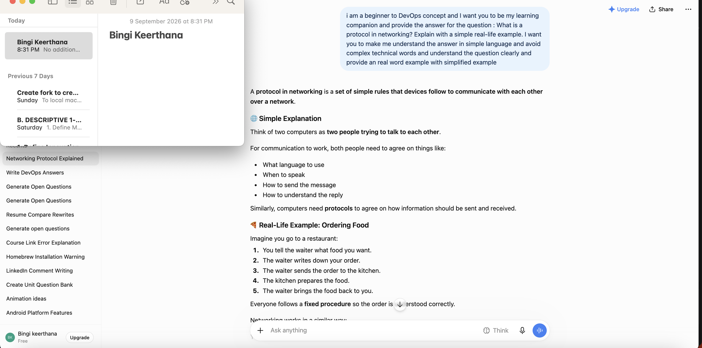
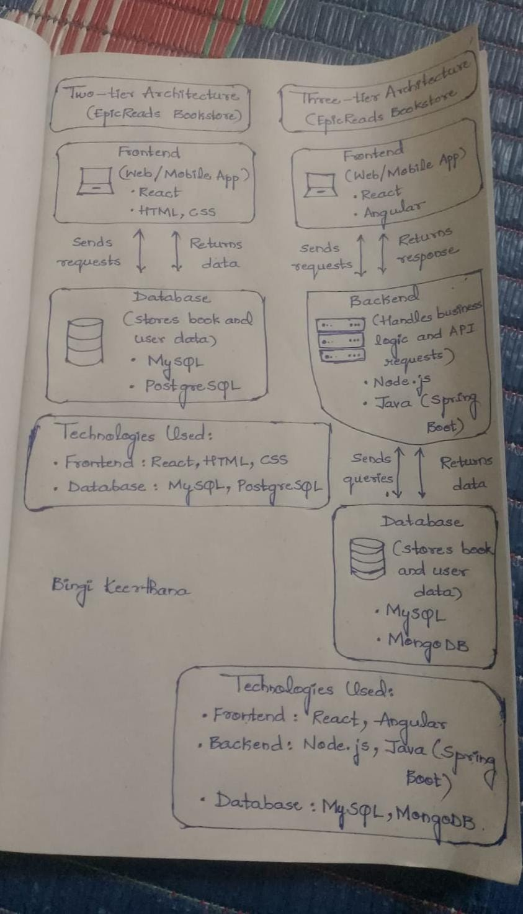
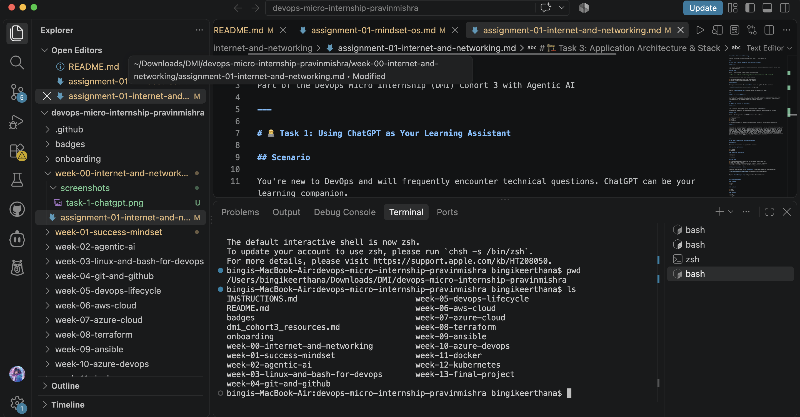

# Week 00 - Internet and Networking

Part of the DevOps Micro Internship (DMI) Cohort 3 with Agentic AI

---

# 🧑‍💻 Task 1: Using ChatGPT as Your Learning Assistant

## Scenario

You're new to DevOps and will frequently encounter technical questions. ChatGPT can be your learning companion.

## Your Task

Write a clear ChatGPT prompt to help you understand:

> "What is a protocol in networking? Explain with a simple real-life example."

Take a screenshot of your interaction showing:

* Your detailed prompt (with clear expectations)
* ChatGPT's simplified response with an example

## Screenshot

Save your screenshot in the `screenshots` folder and update the file name below.




Replace `task-1-chatgpt.png` with your actual screenshot file name.

---

## What I Learned (2–3 lines)

I learned that a protocol is a set of rules that helps computers communicate with each other. For example, like people follow a proper way to order food in a restaurant, computers also follow protocols to send and receive information correctly.

---

# 🌐 Task 2: Internet and Networking

## Scenario

Your friend is launching an online bookstore named **EpicReads**.

He asked you to explain how users globally can access his website hosted in Finland.

## Your Task

Write a short explanation (**100–150 words**) that includes:

* Packet Switching
* IP Address
* TCP/IP
* HTTP/HTTPS

💡 **Tip:** You may use ChatGPT (as demonstrated in Task 1) to refine your explanation.

## Answer

EpicReads is an online bookstore with its website hosted on a server in Finland. Even though the server is in Finland, people from anywhere in the world can still access the website using the internet. Each device has an IP Address, which helps the data know where it needs to go. TCP/IP helps the user's device communicate with the EpicReads server. When someone visits the website, the information is broken into small pieces called packets. This is known as Packet Switching, and the packets can take different routes to reach the server. When they arrive, they are put back together so the website can load. HTTP/HTTPS is used to send information between the user's browser and the server. HTTPS also keeps the connection more secure.


---

# 🏗️ Task 3: Application Architecture & Stack

## Scenario

EpicReads bookstore has two application versions:

### Two-Tier Application

* Frontend
* Database

### Three-Tier Application

* Frontend
* Backend
* Database

## Your Task

* Draw simple diagrams (hand-drawn or tool-based such as draw.io)
* Label each layer clearly
* List at least two common technologies or tools used for each layer
* Submit a screenshot or photo clearly showing your own drawing

## Diagram Screenshot / Photo

Save your diagram image in the `screenshots` folder and update the file name below.




Replace `task-3-diagram.png` with your actual diagram file name.

---

## Technologies Used

### Frontend

* HTML
* CSS

### Backend

* Java
* Python

### Database

* MySQL
* MongoDB

---

# 🌍 Task 4: Domain Name & DNS (Basic Concepts)

## Scenario

Your friend's bookstore **EpicReads** is currently accessible through:

```text
52.172.142.222:3000
```

He purchased the domain:

```text
epicreads.com
```

## Your Task

In **50–100 words**, explain in your own words:

1. What is DNS (Domain Name System)?
2. Which DNS record type should be used to connect the domain to the given IP, and why?

## Answer

DNS (Domain Name System) is like the phonebook of the internet. It converts easy-to-remember domain names, such as epicreads.com, into the IP addresses of the servers hosting them. To connect epicreads.com to 52.172.142.222, an A (Address) record should be used because it maps a domain name to an IPv4 address. The port 3000 is not included in the DNS record; it is handled separately by the application or web server/reverse proxy configuration.

---

# 💻 Task 5: Visual Studio Code Setup (Hands-on)

## Your Task

Install Visual Studio Code (if not already installed).

Take a screenshot of your VS Code environment showing:

* Terminal open inside VS Code
* Running a basic command:

### Windows

```powershell
dir
```

### Linux / macOS

```bash
pwd
ls
```

* Your selected VS Code theme clearly visible

⚠️ **Important:** The screenshot must show your username or another identifiable detail to confirm it is your environment.

## Screenshot

Save your screenshot in the `screenshots` folder and update the file name below.




Replace `task-5-vscode.png` with your actual screenshot file name.

---

# 🔗 Task 6: Publish Your Assignment as a LinkedIn Post

## Objective

Publishing on LinkedIn helps you:

* Build your professional online presence
* Reinforce your learning
* Document your DevOps journey publicly

## Your Task

Summarize your answers from Tasks 1–5 into a LinkedIn post.

Clearly structure your post into the following sections:

* ChatGPT
* Internet & Networking
* App Architecture
* DNS
* VS Code Setup

Add the following credit note at the end of your post:

> **P.S. This post is part of the DevOps Micro Internship (DMI) with Agentic AI — Cohort 3 — by Pravin Mishra. My graded progress is public: https://dmi.pravinmishra.com/s/YOUR-GITHUB-USERNAME.html · Start your DevOps journey: https://dmi.pravinmishra.com/?utm_source=student&utm_medium=ps-linkedin&utm_campaign=cohort3**

---

## LinkedIn Post URL

Paste your LinkedIn post URL here:

https://www.linkedin.com/posts/bingi-keerthana-301841297_dmibypravinmishra-devops-agenticai-ugcPost-7505254583741427712-mP1V/?utm_source=share&utm_medium=member_desktop&rcm=ACoAAEfZXHEBj4jmsCUc2fst6nF00K4qCpW_Wm4

---

## LinkedIn Post Backup Copy

Paste the full text of your LinkedIn post here:

🚀 Week 1 of my DevOps Learning Journey!
I’m happy to share that I completed my first set of tasks in the DevOps Micro Internship.
This week I learned some basic concepts that helped me understand how the internet and applications work.
🤖 ChatGPT
I learned how ChatGPT can be used as a learning assistant. I practiced writing a clear prompt and used it to understand a networking concept with a simple real-life example.
🌐 Internet & Networking
I learned how a user can access a website hosted in another country. I understood the basic concepts of packet switching, IP addresses, TCP/IP and HTTP/HTTPS and how they are involved when we access a website.
🏗️ Application Architecture
I learned about two-tier and three-tier application architectures.
In a two-tier architecture, the frontend communicates with the database. In a three-tier architecture, the frontend communicates with the backend, and the backend communicates with the database.
I also learned about some common technologies used in the frontend, backend and database layers.
🔗 DNS
I learned about DNS (Domain Name System) and how it helps connect a domain name with the IP address of a server.
I also learned that an A record is used when connecting a domain to an IPv4 address. The port number is handled separately by the application or web server.
💻 VS Code Setup
I set up my Visual Studio Code environment and explored the integrated terminal. I also selected a theme and practiced basic commands such as whoami, pwd and ls.
Overall, this week helped me understand the basics of networking, application architecture, DNS and development tools. It was a good starting point for my DevOps journey, and I’m looking forward to learning more! 🚀
Thank you @Pravin Mishra, @Anjana Muthunayake, for the guidance and learning opportunity.
P.S. This post is part of the DevOps Micro Internship (DMI) with Agentic AI — Cohort 3 — by Pravin Mishra. My graded progress is public: https://dmi.pravinmishra.com/s/bingikeerthana547-hue.html · Start your DevOps journey: https://dmi.pravinmishra.com/?utm_source=student&utm_medium=ps-linkedin&utm_campaign=cohort3
#DMIByPravinMishra #DevOps #AgenticAI

---

# Reflection – Week 0

### What did you find easy?

The basic networking concepts were easy for me to understand, especially IP addresses, DNS and HTTP/HTTPS. The real-life examples also made the concepts easier to remember.

---

### What was difficult?

At first, I found it a little difficult to understand how all the networking concepts work together. I was also confused about the difference between an IP address, domain name and port number. After going through examples, I understood them better.

---

### What will you improve next week?

Next week, I want to focus more on practical work instead of only learning the concepts. I want to practice more terminal commands and understand how DevOps tools are actually used in real projects.
---

## 📌 About DMI & CloudAdvisory

DevOps Micro Internship (DMI) is a project-based DevOps program run by Pravin Mishra (The CloudAdvisory) focused on real-world execution, systems thinking, and career readiness.

It helps learners build strong DevOps foundations with hands-on experience.


## 📌 Resources

- 🌐 **DMI Official Website:** https://dmi.pravinmishra.com?utm_source=github&utm_medium=readme  
- 🎓 **University:** https://university.pravinmishra.com?utm_source=github&utm_medium=readme  
- 💬 **Discord Community:** https://discord.pravinmishra.com?utm_source=github&utm_medium=readme  
- 📝 **Blog:** https://dmi.pravinmishra.com/blog?utm_source=github&utm_medium=readme  
- ▶️ **YouTube Playlist (DMI Cohort 3):** https://www.youtube.com/playlist?list=PLFeSNDtI4Cho  
- 🔗 **Pravin Mishra (LinkedIn):** https://www.linkedin.com/in/pravin-mishra-aws-trainer/  
- 🏢 **CloudAdvisory (LinkedIn):** https://www.linkedin.com/company/thecloudadvisory/

---

*This submission is part of DevOps Micro Internship (DMI) Cohort 3 — Agentic AI Track*